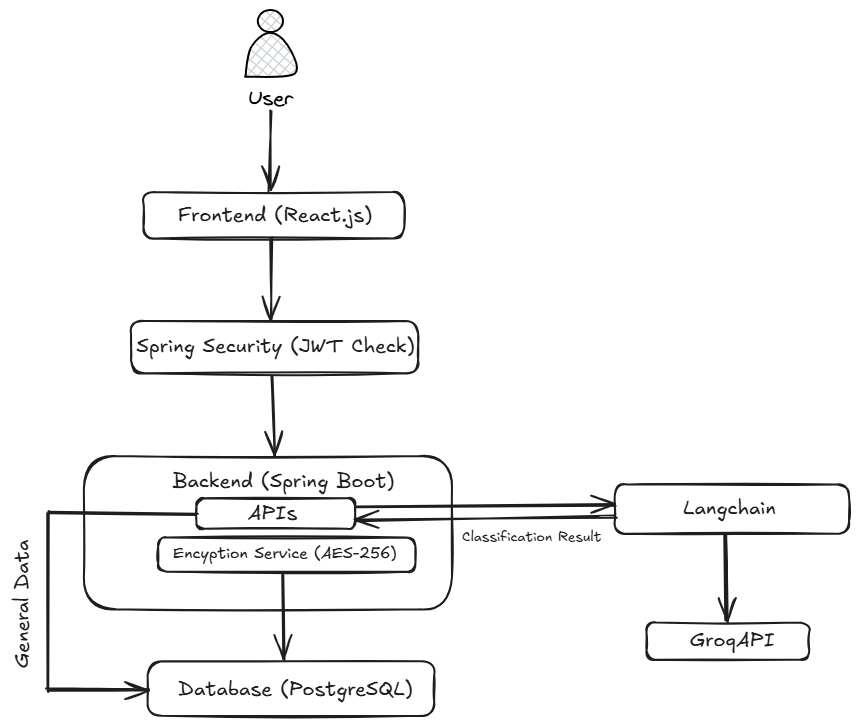
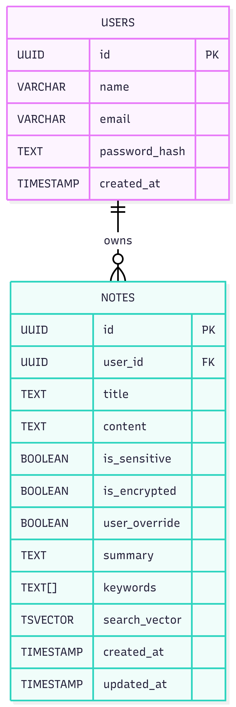

# Secure Notes Application with Langchain

A backend secure notes application with JWT-based authentication, AES encryption for data protection, and AI-powered sensitive data detection, built using Spring Boot, PostgreSQL, and LangChain.



## Key Features

* **Zero Trust Resource Ownership:** Implements strict authorization validation loops at the service layer. Cross-tenant resource sniffing or unauthorized data manipulation attempts across endpoints (including `/view` and `/delete`) are intercepted immediately.
* **Cryptographic At-Rest Encryption:** Core note contents are completely secured using AES-256 encryption before hitting the database persistence layer.
* **Dynamic Data Masking Stream:** Designed an elegant data-masking pipeline that maps database entities to network payload responses. Sensitive content text is masked globally as `"Encypted"` in list view structures, and is decrypted *only* when the authenticated owner explicitly calls the single-note view protocol.
* **Linguistic Search Optimization:** Replaced rigid PostgreSQL text-vector indexes with a flexible, case-insensitive `ILIKE` substring search mechanism. This allows clean, partial-keyword array matching across title fields, summaries, and complex metadata structures without datatype conflicts.
* **AI Summary:** A crisp summary is generated for the note saved allowing the user to understand the note content quickly.


## Tech Stack & Tools

* **Backend Framework:** Java 17 / Spring Boot 3.x (Spring Data JPA, Spring Security)
* **Database:** PostgreSQL (Relational persistence, string-to-array casting)
* **AI Orchestration:** LangChain4j Integration
* **LLM Provider:** Groq Cloud API Engine (`llama-3.3-70b-versatile`)
* **API Verification & Contracts:** Postman Client v10

## Core Dependencies used 
* spring-boot-starter-web
* spring-boot-starter-data-jpa
* spring-boot-starter-security
* postgresql (JDBC Driver)
* lombok
* jjwt-api
* jjwt-impl
* jjwt-jackson
* langchain4j-open-ai-spring-boot-starter



## API Specifications & Contract

The backend exposes a structured, RESTful API contract. All protected endpoints expect a valid JWT token passed via the `Authorization: Bearer <token>` header.

| Method | Endpoint | Access | Description |
| :--- | :--- | :--- | :--- |
| `POST` | `/api/auth/signup` | Public | Registers a new user identity in the system. |
| `POST` | `/api/auth/login` | Public | Authenticates credentials and returns a short-lived JWT. |
| `POST` | `/api/notes/create` | Protected | Extracts text, runs metadata generation via Llama 3, encrypts content, and persists data. |
| `GET` | `/api/notes/search` | Protected | Case-insensitive partial string search across titles and summaries for a specific user ID. |
| `GET` | `/api/notes/view` | Protected | Zero Trust verification check. Decrypts and returns raw plaintext **only** to the owner. |
| `DELETE` | `/api/notes/delete` | Protected | Securely flushes user data records from database partitions upon verified ownership. |


## How to Review & Audit the Contract (Using Postman)

Since this project isolates data logic locally to protect privacy, you can fully evaluate the network validation rules and API payloads without needing to install or run a local database cluster:

1. Import the configuration schema file `postman/Secure-Notes-Application.json` directly into your **Postman Client**.
2. Select any request from the imported folder hierarchy (e.g., `GET /search` or `GET /view`).
3. Click on the **Examples** dropdown menu located in the top-right corner of the Postman response panel.
4. You can instantly inspect the exact cryptographic JSON response structures, masked payload data, and custom error states generated during local test validation runs.


## Local Configuration & Environment Keys

To execute or audit the application framework locally, create a local `.env` file or pass these keys directly into your IDE's run configuration. The `application.properties` blueprint relies on these exact runtime variables:

```properties
# System Runtime Boundary
PORT=8080

# Database Connectivity Profiles
SPRING_DATASOURCE_URL=jdbc:postgresql://localhost:5432/your_database_name
SPRING_DATASOURCE_USERNAME=your_database_username
SPRING_DATASOURCE_PASSWORD=your_database_password

# Security Configuration Primitives
APP_SECURITY_AES_KEY=your_secret_32_character_aes_key
APP_SECURITY_JWT_SECRET=your_long_secure_signing_sha_256_jwt_string
APP_SECURITY_JWT_EXPIRATION_MS=86400000

# LangChain4j Infrastructure Mapping
LANGCHAIN4J_OPENAI_CHATMODEL_BASEURL=[https://api.groq.com/openai/v1](https://api.groq.com/openai/v1)
LANGCHAIN4J_OPENAI_CHATMODEL_APIKEY=your_secret_groq_api_credential_key


